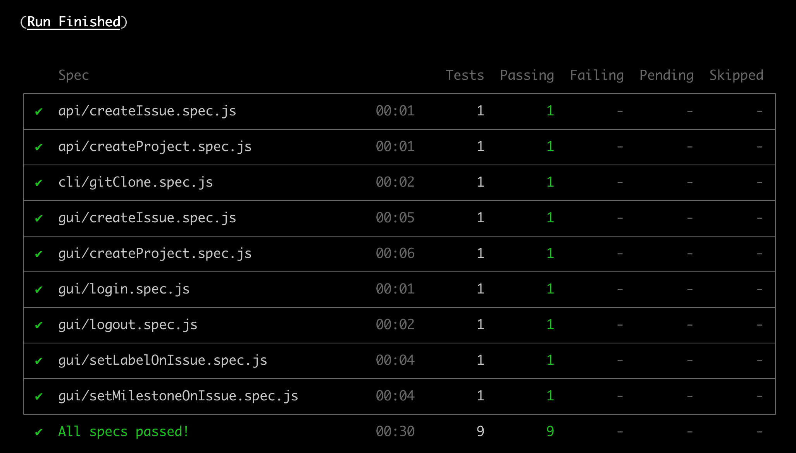

# curso-cypress-intermediario

[Curso intermediário de automação de testes com Cypress](http://talkingabouttesting.coursify.me/courses/testes-automatizados-com-cypress-intermediario) da Escola Talking About Testing.

## Lista das aulas

- [Aula 1 - Setup do ambiente local com Docker](#aula-1-setup-do-ambiente-local-com-docker)
- [Aula 2 - Setup do projeto de testes com Cypress](#aula-2-setup-do-projeto-de-testes-com-cypress)
- [Aula 3 - Testes simples de GUI](#aula-3-testes-simples-de-gui)
- [Aula 4 - Testes intermediários de GUI](#aula-4-testes-intermediários-de-gui)
- [Aula 5 - Testes de API](#aula-5-testes-de-api)
- [Aula 6 - Otimizando os testes de GUI](#aula-6-otimizando-os-testes-de-gui)
- [Aula 7 - Testes com muitas pré-condições](#aula-7-testes-com-muitas-pré-condições)
- [Aula 8 - Executando comandos a nível de sistema](#aula-8-executando-comandos-a-nível-de-sistema)
- [Aula 9 - Executando todos os testes](#aula-9-executando-todos-os-testes)
- [Desligando o container](#desligando-o-container)

## Aula 1 - Setup do ambiente local com Docker

Execute o comando `docker run --publish 80:80 --publish 22:22 --hostname localhost wlsf82/gitlab-ce` e aguarde até o ambiente inicializar (isso pode levar alguns minutos), e então acesse a URL http://localhost/ para definir a senha o usuário `root`.

### Criando um Access Token

1. Faça login com o usuário `root` com a senha definida na seção anterior
2. Clique no avatar do usuário no canto superior direito da tela, clique no link _Settings_, e então clique o menu lateral esquerdo na opção _Access Tokens_
3. No campo nome, digite o valor `curso-cypress-intermediario`, na seção _Scopes_ marque a opção 'api', e então clique no botão 'Create personal access token'

> Uma mensagem de que o token foi criado com sucesso deve ser exibida, além do token propriamente dito. Copie o token clicando no botão à direita do campo e guarde-o para utilizar na aula 2.

### Adicionando uma chave SSH

1. No terminal, digite o seguinte comando e pressione ENTER `ssh-keygen -t ed25519 -C "root@example.com"`
2. Será solicitado um caminho para salvar a chave. Pressione ENTER para aceitar o caminho padrão
3. Será solicitada uma senha. Pressione ENTER para que a senha não seja necessária
4. Será solicitado que repita a senha. Pressione ENTER novamente para que a senha não seja necessária
5. No terminal, digite o seguinte comando e pressione ENTER para copiar a chave pública recém criada para a área de transferência `pbcopy < ~/.ssh/id_ed25519.pub`
6. Logado na aplicação com o usuário `root`, clique no avatar do usuário no canto superior direito da tela, clique no link _Settings_, e então clique no menu lateral esquerdo na opção _SSH Keys_
7. Cole sua chave SSH pública no campo key. O campo Title deve ser automaticamente preenchido
8. Por fim, clique no botão Add key

> Você também encontrará instruções sobre como gerar a chave SSH em sistema operacional Windows na própria aplicação em teste a partir da seguinte URL http://localhost/help/ssh/README#generating-a-new-ssh-key-pair (**instruções em Inglês**).

## Aula 2 - Setup do projeto de testes com Cypress

### Clonando o projeto

1. Acesse a URL https://gitlab.com/wlsf82/curso-cypress-intermediario
2. Clique no botão 'Clone'
3. Escolha uma das opções (_Clone with SSH_ ou _Clone with HTTPS_) e então clique no botão _Copy URL_ ao lado do campo da opção escolhida
4. No terminal, no diretório onde você armazena seus projetos de software, digite `git clone [URL copiada no passo anteior] e pressione ENTER
5. Por fim, acesso o diretório do projeto recém clonado (`cd curso-cypress-intermediario/`)

### Inicializando o NPM

No terminal, dentro do diretório `curso-cypress-intermediario/`, execute o comando `npm init -y` (este comando irá criar o arquivo `package.json` na raiz do projeto)

### Inicializando o arquivo .gitignore

No mesmo diretório, crie um arquivo chamado `.gitignore`, com o seguinte conteúdo:

```.gitignore
.DS_Store
cypress.env.json
cypress/screenshots/
cypress/videos/
node_modules/
temp/
```

### Criando o diretório `temp/`

Na raiz do projeto, crie um diretório chamado `temp/`. Este diretório será utilizado posteriormente para o teste de clone de projeto.

### Instalando o Cypress

No terminal, na raiz do projeto, execute o comando `npm i cypress -D` (este comando irá instalar o Cypress como dependência de desenvolvimento, além de criar o arquivo `package-lock.json` e o diretório `node_modules/`)

### Inicializando o Cypress

No terminal, na raiz do projeto, execute o comando `npx cypress open` (este comando irá abrir o Cypress em modo interativo e irá criar a estrutura inicial para os testes automatizados)

#### Configurando o projeto de testes automatizados

1. Feche a aplicação Electron do Cypress
2. Abra o arquivo `cypress.json` criado na raiz do projeto e altere seus conteúdo pelo seguinte:

```json
{
    "baseUrl": "http://localhost/"
}
```

3. Ainda na raiz do projeto, crie um arquivo chamado `cypress.env.json` com os seguintes dados:

```json
{
    "user_name": "root",
    "user_password": "password-do-usuario-root-definido-anteriormente",
    "gitlab_access_token": "access-token-criado-anteriormente"
}
```

4. Por fim, dentro do diretório `cypress/integration/`, delete o diretório `examples/`

## Aula 3 - Testes simples de GUI

### Testando login

1. Dentro do diretório `cypress/integration/`, crie um novo diretório chamado `gui` (_graphical user interface_)
2. Dentro do diretrório `cypress/integration/gui/`, crie um arquivo chamado `login.spec.js` com os seguintes dados:

```js
/// <reference types="Cypress" />

describe('Login', () => {
  it('successfully', () => {
    cy.login()

    cy.get('.qa-user-avatar').should('exist')
  })
})

```

3. Dentro do diretório `cypress/support/`, renomeie o arquivo `commands.js` por `gui_commands.js` e altere seu conteúdo pelo o seguinte:

```js
/// <reference types="Cypress" />

Cypress.Commands.add('login', () => {
  cy.visit('users/sign_in')

  cy.get("[data-qa-selector='login_field']").type(Cypress.env('user_name'))
  cy.get("[data-qa-selector='password_field']").type(Cypress.env('user_password'))
  cy.get("[data-qa-selector='sign_in_button']").click()
})

```

4. Dentro do diretório `cypress/support/`, altere os dados do arquivo `index.js` pelo seguinte:

```js
import './gui_commands'

```

5. Por fim, no terminal, na raiz do projeto, execute o comando `npx cypress run` para executar o novo teste em modo headless

### Testando logout

1. Dentro do diretrório `cypress/integration/gui/`, crie um arquivo chamado `logout.spec.js` com os seguintes dados:

```js
/// <reference types="Cypress" />

describe('Logout', () => {
  beforeEach(() => cy.login())

  it('successfully', () => {
    cy.logout()

    cy.url().should('be.equal', `${Cypress.config('baseUrl')}users/sign_in`)
  })
})

```

2. Dentro do diretório `cypress/support/`, atualize o arquivo `gui_commands.js` com o commando `logout`, conforme abaixo:

```js
/// <reference types="Cypress" />

Cypress.Commands.add('login', () => {
  ...
})

Cypress.Commands.add('logout', () => {
  cy.get('.qa-user-avatar').click()
  cy.contains('Sign out').click()
})

```

3. Por fim, no terminal, na raiz do projeto, execute o comando `npx cypress run --spec cypress/integration/gui/logout.spec.js` para executar o novo teste em modo headless

### Testando criação de projeto

1. Para o teste de criação de projeto iremos utilizar a biblioteca `faker` para a criação de dados randômicos. No terminal, na raiz do projeto, execute o comando `npm i faker -D` (este comando irá instalar a biblioteca `faker` como dependência de desenvolvimento)

2. Dentro do diretrório `cypress/integration/gui/`, crie um arquivo chamado `createProject.spec.js` com os seguintes dados:

```js
/// <reference types="Cypress" />

const faker = require('faker')

describe('Create Project', () => {
  beforeEach(() => cy.login())

  it('successfully', () => {
    const project = {
      name: `project-${faker.random.uuid()}`,
      description: faker.random.words(5)
    }

    cy.gui_createProject(project)

    cy.url().should('be.equal', `${Cypress.config('baseUrl')}${Cypress.env('user_name')}/${project.name}`)
    cy.contains(project.name).should('be.visible')
    cy.contains(project.description).should('be.visible')
  })
})

```

3. Dentro do diretório `cypress/support/`, atualize o arquivo `gui_commands.js` com o commando `gui_createProject`, conforme abaixo:

```js
/// <reference types="Cypress" />

Cypress.Commands.add('login', () => {
  ...
})

Cypress.Commands.add('logout', () => {
  ...
})

Cypress.Commands.add('gui_createProject', project => {
  cy.visit('projects/new')

  cy.get('#project_name').type(project.name)
  cy.get('#project_description').type(project.description)
  cy.get('.qa-initialize-with-readme-checkbox').check()
  cy.contains('Create project').click()
})

```

4. Por fim, no terminal, na raiz do projeto, execute o comando `npx cypress run --spec cypress/integration/gui/createProject.spec.js` para executar o novo teste em modo headless

## Aula 4 - Testes intermediários de GUI

### Testando criação de issue

1. Dentro do diretrório `cypress/integration/gui/`, crie um arquivo chamado `createIssue.spec.js` com os seguintes dados:

```js
/// <reference types="Cypress" />

const faker = require('faker')

describe('Create Issue', () => {
  const issue = {
    title: `issue-${faker.random.uuid()}`,
    description: faker.random.words(3),
    project: {
      name: `project-${faker.random.uuid()}`,
      description: faker.random.words(5)
    }
  }

  beforeEach(() => {
    cy.login()
    cy.gui_createProject(issue.project)
  })

  it('successfully', () => {
    cy.gui_createIssue(issue)

    cy.get('.issue-details')
      .should('contain', issue.title)
      .and('contain', issue.description)
  })
})

```

3. Dentro do diretório `cypress/support/`, atualize o arquivo `gui_commands.js` com o commando `gui_createIssue`, conforme abaixo:

```js
/// <reference types="Cypress" />

Cypress.Commands.add('login', () => {
  ...
})

Cypress.Commands.add('logout', () => {
  ...
})

Cypress.Commands.add('gui_createProject', project => {
  ...
})

Cypress.Commands.add('gui_createIssue', issue => {
  cy.visit(`${Cypress.env('user_name')}/${issue.project.name}/issues/new`)

  cy.get('.qa-issuable-form-title').type(issue.title)
  cy.get('.qa-issuable-form-description').type(issue.description)
  cy.contains('Submit issue').click()
})

```

4. Por fim, no terminal, na raiz do projeto, execute o comando `npx cypress run --spec cypress/integration/gui/createIssue.spec.js` para executar o novo teste em modo headless

## Aula 5 - Testes de API

### Testando criação de projeto

1. Dentro do diretório `cypress/integration/`, crie um novo diretório chamado `api` (_application programming interface_)
2. Dentro do diretrório `cypress/integration/api/`, crie um arquivo chamado `createProject.spec.js` com os seguintes dados:

```js
/// <reference types="Cypress" />

const faker = require('faker')

describe('Create Project', () => {
  it('successfully', () => {
    const project = {
      name: `project-${faker.random.uuid()}`,
      description: faker.random.words(5)
    }

    cy.api_createProject(project)
      .then(response => {
        expect(response.status).to.equal(201)
        expect(response.body.name).to.equal(project.name)
        expect(response.body.description).to.equal(project.description)
      })
  })
})

```

3. Dentro do diretório `cypress/support/`, crie um arquivo chamado `api_commands.js`, com os seguintes dados:

```js
/// <reference types="Cypress" />

const accessToken = Cypress.env('gitlab_access_token')

Cypress.Commands.add('api_createProject', project => {
  cy.request({
    method: 'POST',
    url: `/api/v4/projects/?private_token=${accessToken}`,
    body: {
      name: project.name,
      description: project.description,
      initialize_with_readme: true
    }
  })
})

```

4. Dentro do diretório `cypress/support/`, adicione ao arquivo `index.js` o import do arquivo `api_commands.js`, conforme abaixo:

```js
import './api_commands'
import './gui_commands'

```

5. Por fim, no terminal, na raiz do projeto, execute o comando `npx cypress run --spec cypress/integration/api/createProject.spec.js` para executar o novo teste em modo headless.

### Testando criação de issue

1. Dentro do diretrório `cypress/integration/api/`, crie um arquivo chamado `createIssue.spec.js` com os seguintes dados:

```js
/// <reference types="Cypress" />

const faker = require('faker')

describe('Create issue', () => {
  it('successfully', () => {
    const issue = {
      title: `issue-${faker.random.uuid()}`,
      description: faker.random.words(3),
      project: {
        name: `project-${faker.random.uuid()}`,
        description: faker.random.words(5)
      }
    }

    cy.api_createIssue(issue)
      .then(response => {
        expect(response.status).to.equal(201)
        expect(response.body.title).to.equal(issue.title)
        expect(response.body.description).to.equal(issue.description)
      })
  })
})

```

2. Dentro do diretório `cypress/support/`, atualize o arquivo `api_commands.js` com o commando `api_createIssue`, conforme abaixo:

```js
/// <reference types="Cypress" />

const accessToken = Cypress.env('gitlab_access_token')

Cypress.Commands.add('api_createProject', project => {
  ...
})

Cypress.Commands.add('api_createIssue', issue => {
  cy.api_createProject(issue.project)
    .then(response => {
      cy.request({
        method: 'POST',
        url: `/api/v4/projects/${response.body.id}/issues?private_token=${accessToken}`,
        body: {
          title: issue.title,
          description: issue.description
        }
      })
  })
})

```

3. Por fim, no terminal, na raiz do projeto, execute o comando `npx cypress run --spec cypress/integration/api/createIssue.spec.js` para executar o novo teste em modo headless.

## Aula 6 - Otimizando os testes de GUI

1. No arquivo `cypress/integration/gui/createIssue.spec.js`, substitua o comando `cy.gui_createProject(issue.project)` pelo seguinte `cy.api_createProject(issue.project)`. Desta forma, em vez de criarmos o projeto via GUI, o criamos via API, visto que tal opção é mais rápida, além de tornar o teste mais independente.
2. Por fim, no terminal, na raiz do projeto, execute o comando `npx cypress run --spec cypress/integration/gui/createIssue.spec.js` para executar o teste refatorado em modo headless

## Aula 7 - Testes com muitas pré-condições

### Testando adição de um label à uma issue

1. No diretório `cypress/integration/gui/`, crie um arquivo chamado `setLabelOnIssue.spec.js` com o seguinte conteúdo:

```js
/// <reference types="Cypress" />

const faker = require('faker')

describe('Set label on issue', () => {
  const issue = {
    title: `issue-${faker.random.uuid()}`,
    description: faker.random.words(3),
    project: {
      name: `project-${faker.random.uuid()}`,
      description: faker.random.words(5)
    }
  }

  const label = {
    name: `label-${faker.random.word()}`,
    color: '#ffaabb'
  }

  beforeEach(() => {
    cy.login()
    cy.api_createIssue(issue)
      .then(response => {
        cy.api_createLabel(response.body.project_id, label)
        cy.visit(`${Cypress.env('user_name')}/${issue.project.name}/issues/${response.body.iid}`)
      })
  })

  it('successfully', () => {
    cy.gui_setLabelOnIssue(label)

    cy.get('.qa-labels-block').should('contain', label.name)
    cy.get('.qa-labels-block span')
      .should('have.attr', 'style', `background-color: ${label.color}; color: #333333;`)
  })
})

```

2. No diretório `cypress/support/`, atualize o arquivo `api_commands.js` conforme abaixo:

```js
/// <reference types="Cypress" />

const accessToken = Cypress.env('gitlab_access_token')

Cypress.Commands.add('api_createProject', project => {
  ...
})

Cypress.Commands.add('api_createIssue', issue => {
  ...
})

Cypress.Commands.add('api_createLabel', (projectId, label) => {
  cy.request({
    method: 'POST',
    url: `/api/v4/projects/${projectId}/labels?private_token=${accessToken}`,
    body: {
      name: label.name,
      color: label.color
    }
  })
})

```

3. No diretório `cypress/support/`, atualize o arquivo `gui_commands.js` conforme abaixo:

```js
/// <reference types="Cypress" />

Cypress.Commands.add('login', () => {
  ...
})

Cypress.Commands.add('logout', () => {
  ...
})

Cypress.Commands.add('gui_createProject', project => {
  ...
})

Cypress.Commands.add('gui_createIssue', issue => {
  ...
})

Cypress.Commands.add('gui_setLabelOnIssue', label => {
  cy.get('.qa-edit-link-labels').click()
  cy.contains(label.name).click()
  cy.get('body').click()
})

```

4. Por fim, no terminal, na raiz do projeto, execute o comando `npx cypress run --spec cypress/integration/gui/setLabelOnIssue.spec.js` para executar o novo teste em modo headless

### Testando adição de uma milestone à uma issue

1. No diretório `cypress/integration/gui/`, crie um arquivo chamado `setMilestoneOnIssue.spec.js` com o seguinte conteúdo:

```js
/// <reference types="Cypress" />

const faker = require('faker')

describe('Set milestone on issue', () => {
  const issue = {
    title: `issue-${faker.random.uuid()}`,
    description: faker.random.words(3),
    project: {
      name: `project-${faker.random.uuid()}`,
      description: faker.random.words(5)
    }
  }

  const milestone = {
    title: `milestone-${faker.random.word()}`
  }

  beforeEach(() => {
    cy.login()
    cy.api_createIssue(issue)
      .then(response => {
        cy.api_createMilestone(response.body.project_id, milestone)
        cy.visit(`${Cypress.env('user_name')}/${issue.project.name}/issues/${response.body.iid}`)
      })
  })

  it('successfully', () => {
    cy.gui_setMilestoneOnIssue(milestone)

    cy.get('.block.milestone').should('contain', milestone.title)
  })
})

```

2. No diretório `cypress/support/`, atualize o arquivo `api_commands.js` conforme abaixo:

```js
/// <reference types="Cypress" />

const accessToken = Cypress.env('gitlab_access_token')

Cypress.Commands.add('api_createProject', project => {
  ...
})

Cypress.Commands.add('api_createIssue', issue => {
  ...
})

Cypress.Commands.add('api_createLabel', (projectId, label) => {
  ...
})

Cypress.Commands.add('api_createMilestone', (projectId, milestone) => {
  cy.request({
    method: 'POST',
    url: `/api/v4/projects/${projectId}/milestones?private_token=${accessToken}`,
    body: { title: milestone.title }
  })
})

```

3. No diretório `cypress/support/`, atualize o arquivo `gui_commands.js` conforme abaixo:

```js
/// <reference types="Cypress" />

Cypress.Commands.add('login', () => {
  ...
})

Cypress.Commands.add('logout', () => {
  ...
})

Cypress.Commands.add('gui_createProject', project => {
  ...
})

Cypress.Commands.add('gui_createIssue', issue => {
  ...
})

Cypress.Commands.add('gui_setLabelOnIssue', label => {
  ...
})

Cypress.Commands.add('gui_setMilestoneOnIssue', milestone => {
  cy.get('.block.milestone .edit-link').click()
  cy.contains(milestone.title).click()
})

```

4. Por fim, no terminal, na raiz do projeto, execute o comando `npx cypress run --spec cypress/integration/gui/setMilestoneOnIssue.spec.js` para executar o novo teste em modo headless

## Aula 8 - Executando comandos a nível de sistema

### Testando git clone

1. No diretório `cypress/integration/`, crie um novo diretório chamado `cli/` (command line interface)
2. No diretório `cypress/integration/cli/`, crie um arquivo chamado `gitClone.spec.js` com o seguinte conteúdo:

```js
/// <reference types="Cypress" />

const faker = require('faker')

describe('git clone', () => {
  const project = {
    name: `project-${faker.random.uuid()}`,
    description: faker.random.words(5)
  }

  beforeEach(() => cy.api_createProject(project))

  it('successfully', () => {
    cy.cloneViaSSH(project)

    cy.readFile(`temp/${project.name}/README.md`)
      .should('contain', `# ${project.name}`)
      .and('contain', project.description)
  })
})

```

3. No diretório `cypress/support/`, crie um arquivo chamado `cli_commands.js` com o seguinte conteúdo:

```js
/// <reference types="Cypress" />

Cypress.Commands.add('cloneViaSSH', project => {
  const domain = Cypress.config('baseUrl').replace('http://', '').replace('/', '')

  cy.exec(`cd temp/ && git clone git@${domain}:${Cypress.env('user_name')}/${project.name}.git`)
})
```

4. Dentro do diretório `cypress/support/`, adicione ao arquivo `index.js` o import do arquivo `cli_commands.js`, conforme abaixo:

```js
import './api_commands'
import './cli_commands'
import './gui_commands'

```

5. Por fim, no terminal, na raiz do projeto, execute o comando `npx cypress run --spec cypress/integration/cli/gitClone.spec.js` para executar o novo teste em modo headless

> Obs.: Na primeira vez que você executar o teste o seguinte será solicitado: `Are you sure you want to continue connecting (yes/no)?` Responda `yes` e pressione ENTER.

> Obs.2: Caso o teste falhe com o erro abaixo, execute o seguinte comando `ssh-keygen -R localhost`, pressione ENTER, e então execute o teste novamente (`npx cypress run --spec cypress/integration/cli/gitClone.spec.js`):

```sh
CypressError: cy.exec('cd temp/ && git clone git@localhost:root/project-8074da23-f979-4555-84e8-7a63fb69a326.git') failed because the command exited with a non-zero code.

Pass {failOnNonZeroExit: false} to ignore exit code failures.

Information about the failure:
Code: 128

Stderr:
Cloning into 'project-8074da23-f979-4555-84e8-7a63fb69a326'...
@@@@@@@@@@@@@@@@@@@@@@@@@@@@@@@@@@@@@@@@@@@@@@@@@@@@@@@@@@@
@    WARNING: REMOTE HOST IDENTIFICATION HAS CHANGED!     @
@@@@@@@@@@@@...
      at Object.cypressErr (http://localhost/__cypress/runner/cypress_runner.js:106136:11)
      at Object.throwErr (http://localhost/__cypress/runner/cypress_runner.js:106091:18)
      at Object.throwErrByPath (http://localhost/__cypress/runner/cypress_runner.js:106123:17)
      at http://localhost/__cypress/runner/cypress_runner.js:90175:23
      at tryCatcher (http://localhost/__cypress/runner/cypress_runner.js:140400:23)
      at Promise._settlePromiseFromHandler (http://localhost/__cypress/runner/cypress_runner.js:138336:31)
      at Promise._settlePromise (http://localhost/__cypress/runner/cypress_runner.js:138393:18)
      at Promise._settlePromise0 (http://localhost/__cypress/runner/cypress_runner.js:138438:10)
      at Promise._settlePromises (http://localhost/__cypress/runner/cypress_runner.js:138517:18)
      at Async../node_modules/bluebird/js/release/async.js.Async._drainQueue (http://localhost/__cypress/runner/cypress_runner.js:135125:16)
      at Async../node_modules/bluebird/js/release/async.js.Async._drainQueues (http://localhost/__cypress/runner/cypress_runner.js:135135:10)
      at Async.drainQueues (http://localhost/__cypress/runner/cypress_runner.js:135009:14)
```

## Aula 9 - Executando todos os testes

### Modo headless

1. Abra o arquivo `package.json` localizado na raiz do projeto
2. Na seção `scripts`, altere o valor do script `test` para `cypress run`

A seção `scripts` do arquivo `package.json` deve estar conforme abaixo:

```json
"scripts": {
  "test": "cypress run"
},
```

3. Por fim, no terminal, na raiz do projeto, execute o comando `npm test` para executar todos os testes em modo headless. Você deve obter um resultado conforme demonstrado na imagem abaixo.



### Modo interativo

1. No terminal, na raiz do projeto, execute o comando `npx cypress open` (este comando irá abrir a aplicação Electron do Cypress)
2. Para executar todos os testes em modo interativo, clique no botão 'Run all specs'. Ou, para executar um arquivo de testes em específico, clique no mesmo na listagem de testes.

## Parabéns, você chegou ao fim do curso!

### Desligando o container

1. No terminal, execute o comando `docker container ls`, pressione ENTER e copie o `CONTAINER ID` referente à imagen `wlsf82/gitlab-ce`
2. Por fim, execute o comando `docker container stop [CONTAINER ID copiado no passo anterior]` e pressione ENTER

> Observação: Após desligar o container, caso você queira inicilizar a aplicação novamente, [siga os passo descritos na aula 1](#aula-1-setup-do-ambiente-local-com-docker) e **lembre-se de atualizar os valores no arquivo `cypress.env.json`**, conforme descrito na aula 2, [passo 3](#configurando-o-projeto-de-testes-automatizados)
___

Made with 💚 by [Talking About Testing](https://talkingabouttesting.coursify.me/)
